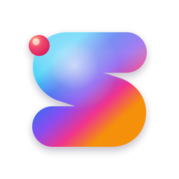
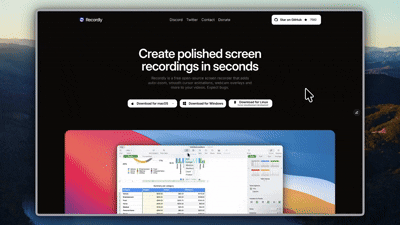
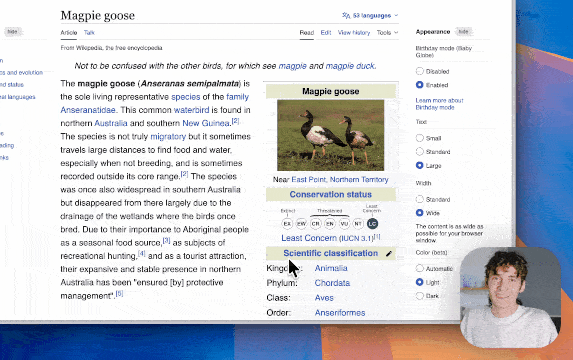
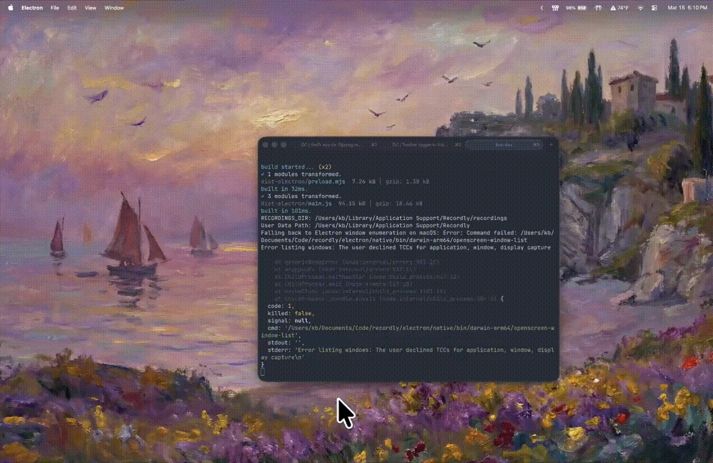
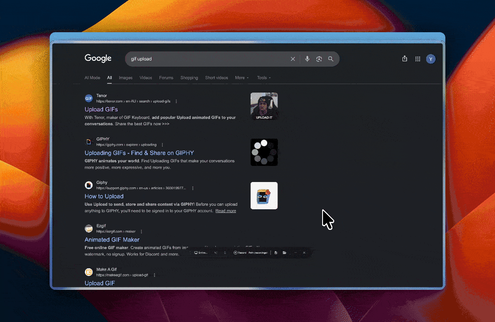
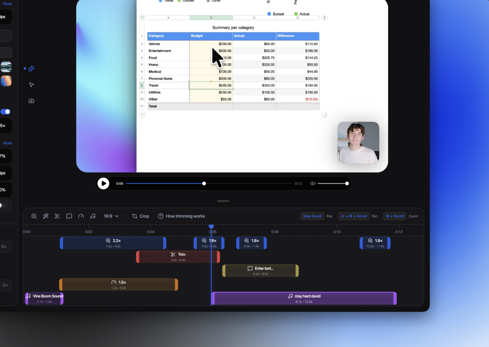

<div align="center">



# Screenly

### Local-first screen recording, AI, and editing — polished demo videos in minutes

Language: EN&nbsp;|&nbsp;[简中](README.zh-CN.md)


**[Install](#installation)** &nbsp;·&nbsp; **[Features](#core-features)** &nbsp;·&nbsp; **[Releases](https://github.com/iamadarsha/screenly/releases)** &nbsp;·&nbsp; **[Contributing](CONTRIBUTING.md)**

Screenly is your **open-source, local-first screen recorder** and editor for **walkthroughs, demos, product videos**, and more — with on-device AI (transcription, translation, and neural voiceover) that never leaves your machine. **Accepting PRs.**

<br/>



</div>

---

## What is Screenly?

Screenly is a desktop app for recording and editing screen captures with motion-driven presentation tools built in. Instead of sending raw footage to a motion designer just to add zooms, cursor polish, or a styled background, Screenly handles that workflow in one place for free.

Screenly runs on:

- **macOS** 14.0+
- **Windows** 10 Build 19041+
- **Linux** on modern distros

Platform notes:

- **macOS** uses native ScreenCaptureKit-based capture helpers.
- **Windows** uses a native Windows Graphics Capture (WGC) helper on supported builds, with native WASAPI audio support.
- **Linux** records through Electron capture APIs. Cursor hiding is not supported on Linux today.

---

# Core Features

<table>
<tr>
<td width="50%" valign="top">

### 🎯 Auto-zooms & cursor polish
Automatic zoom suggestions from cursor activity, smooth cursor movement, motion effects, and a styled frame with wallpapers, gradients, blur, padding, and shadows.


</td>
<td width="50%" valign="top">

### 🎥 Dynamic webcam bubble overlays
Overlay webcam footage as a bubble, position it with presets or custom coordinates, mirror it, style shadow and roundness, and make it react to zoom.



</td>
</tr>
<tr>
<td width="50%" valign="top">

### 🖱️ Cursor sway & loop mode
Cursor smoothing, motion blur, click bounce, sway, and a loop mode built for clean, seamlessly-looping exports.



</td>
<td width="50%" valign="top">

### ✂️ Timeline editing built for demos
Drag-and-drop tools for zooms, trims, speed regions, annotations, extra audio, and crop-aware edits. Save and reopen work as `.screenly` projects.



</td>
</tr>
</table>

### 🧠 On-device AI: transcription, translation, and voiceover
Screenly ships with local AI models (Whisper for transcription, Gemma for translation, and Kokoro for neural voiceover) that run entirely on-device — no footage or audio ever leaves your machine. Models download once and run offline after that; a built-in native-speech fallback is always available.

<p align="center">
  
</p>

### 🧩 Extensions & Marketplace
Screenly has a community-driven extension system. Anyone can build and publish extensions that add new capabilities to Screenly — cursor click sounds, device frames, browser mockups, wallpapers, render hooks, settings panels, and more.

---

## All Features

### Recording

- Record an entire display or a single app window
- Jump directly from recording into the editor
- Capture microphone audio and system audio
- Use native capture backends where supported
- Resume editing from saved `.screenly` project files (legacy `.recordly` / `.openscreen` files remain openable)
- Open existing recordings or existing project files from the app

### Timeline and Editing

- Drag-and-drop timeline editing
- Trim unwanted sections
- Add manual zoom regions
- Use automatic zoom suggestions based on cursor activity
- Add speed-up and slow-down regions
- Add text, image, and figure annotations
- Add extra audio regions on the timeline
- Crop the recorded frame
- Save and reopen projects with editor state preserved

### Cursor Controls

- Show or hide the rendered cursor overlay
- Cursor size adjustment
- Cursor smoothing
- Cursor motion blur
- Cursor click bounce
- Cursor sway
- Cursor loop mode for cleaner looping exports
- macOS-style cursor assets for the rendered overlay

### Webcam Overlay

- Enable or disable webcam overlay footage
- Upload, replace, or remove webcam footage
- Mirror webcam footage
- Size control
- Preset positions and custom X/Y placement
- Margin control
- Roundness control
- Shadow control
- Optional zoom-reactive webcam scaling

### Frame Styling and Backgrounds

- Built-in wallpapers
- Runtime wallpaper discovery from the wallpapers directory
- Custom uploaded backgrounds
- Solid color backgrounds
- Gradient backgrounds
- Frame padding
- Rounded corners
- Background blur
- Drop shadows
- Aspect ratio presets for the final frame

### AI Tools

- Local transcription (Whisper) with caption generation
- Local translation (Gemma) across supported languages
- Local neural voiceover (Kokoro), with a native-speech fallback when the model isn't downloaded or a recording is in progress

### Export

- MP4 export
- GIF export
- Export quality selection
- GIF frame-rate selection
- GIF loop toggle
- GIF size presets
- Aspect ratio and output dimension controls
- Reveal exported files in the system file manager

### Workflow and Usability

- Customizable keyboard shortcuts
- In-app shortcut reference
- Feedback and issue links from the editor
- Project persistence for editor preferences
- Faster preview recovery after export
---

# Installation

## Quick install (one command)

**macOS** — downloads the correct build for your Mac's chip and installs to `/Applications`:

```bash
curl -fsSL https://raw.githubusercontent.com/iamadarsha/screenly/main/scripts/install.sh | bash
```

**Windows** (PowerShell) — downloads and launches the installer:

```powershell
irm https://raw.githubusercontent.com/iamadarsha/screenly/main/scripts/install.ps1 | iex
```

> [!NOTE]
> Screenly builds are not yet signed with an Apple Developer ID / notarization or a Windows code-signing certificate. On macOS the quick-install script avoids the Gatekeeper warning (see below); on Windows, SmartScreen will prompt once — choose "More info" → "Run anyway".

## Download a build manually

Prebuilt releases are available at:

https://github.com/iamadarsha/screenly/releases

---

## Build from source

### Prerequisites

**macOS:** Xcode Command Line Tools (`xcode-select --install`).

**Linux (Ubuntu/Debian):**

```bash
sudo apt install build-essential cmake libx11-dev libxtst-dev libxrandr-dev libxt-dev
```

**Windows:** Visual Studio 2022 (or Build Tools) with the C++ workload and CMake.

### Steps

```bash
git clone https://github.com/iamadarsha/screenly.git screenly
cd screenly
npm install
npm run dev
```

For packaged builds:

```bash
npm run build
```

Target-specific build commands are also available:

- `npm run build:mac`
- `npm run build:win`
- `npm run build:linux`

---

## macOS: "App cannot be opened"

This only affects builds you download from a browser or build yourself locally (the quick-install script above avoids it, since files downloaded with `curl` aren't quarantined by macOS). macOS may still quarantine a browser-downloaded or locally built app.

Remove the quarantine flag with:

```bash
xattr -rd com.apple.quarantine /Applications/Screenly.app
```

---

# System Requirements

| Platform | Minimum version | Notes |
|---|---|---|
| **macOS** | macOS 14.0 (Sonoma) | Required for ScreenCaptureKit audio and microphone capture. |
| **Windows** | Windows 10 20H1 (Build 19041, May 2020) | Required for the native Windows Graphics Capture (WGC) helper and best cursor-hiding behavior. |
| **Linux** | Any modern distro | Recording works through Electron capture. System audio generally requires PipeWire. |

> [!IMPORTANT]
> On Windows builds older than 19041, recording can still work through fallback capture, but the real OS cursor may remain visible in recordings.

---

# Usage

## Record

1. Launch Screenly.
2. Select a screen or window.
3. Choose microphone and system-audio options.
4. Start recording.
5. Stop recording to open the editor.

## Edit

Inside the editor you can:

- add trims, zooms, speed regions, and annotations
- tune cursor behavior and preview volume
- style the frame with wallpapers, colors, gradients, blur, padding, and corners
- add or adjust webcam overlay footage
- add extra audio regions
- crop the frame and choose an aspect ratio
- generate captions, translate them, or add an AI voiceover — all processed locally on-device

Save your work anytime as a `.screenly` project.

## Export

Export options include:

- **MP4** for standard video output
- **GIF** for lightweight sharing and loops

You can adjust format-specific settings such as quality, GIF frame rate, GIF looping, and output size before export.

---

# Limitations

### Cursor capture

Screenly renders a polished cursor overlay on top of the recording. Platform cursor-hiding behavior still depends on OS support.

**macOS**
- ScreenCaptureKit can exclude the real cursor cleanly.

**Windows**
- Best results require Windows 10 Build 19041+ and the native capture helper.
- Older builds fall back to Electron capture, so the real cursor may remain visible.

**Linux**
- Electron desktop capture does not currently support cursor hiding.
- If you also enable the rendered cursor overlay, exports may show both the real cursor and the styled cursor.

### System audio

System audio support varies by platform.

**Windows**
- Native WASAPI support

**Linux**
- Usually requires PipeWire

**macOS**
- Requires macOS 14.0+ and the ScreenCaptureKit-based workflow

---

# How It Works

Screenly combines a platform-specific capture layer with a renderer-driven editor and export pipeline.

**Capture**
- Electron coordinates recording and application flow
- macOS uses native ScreenCaptureKit helpers
- Windows uses a native Windows Graphics Capture (WGC) helper and native audio helpers where available

**Editing**
- Timeline regions define zooms, trims, speed changes, audio overlays, and annotations
- Cursor and webcam styling are applied in the editor state

**Rendering**
- Scene composition is handled by **PixiJS**

**Export**
- The same scene logic used in preview is rendered into exported MP4 or GIF output

**AI**
- Transcription (Whisper), translation (Gemma), and voiceover (Kokoro) all run as local ONNX models on-device; nothing is uploaded

**Projects**
- `.screenly` files store the source media path plus editor state so work can be reopened later (legacy `.recordly` / `.openscreen` files remain openable)

---

# Contribution

Contributions are welcome.

Areas where help is especially useful:

- Linux capture and cursor behavior
- Export performance and stability
- UI and UX refinement
- Localisation work
- Additional editor tools and workflow polish

Please keep pull requests focused, test recording/edit/export flows, and avoid unrelated refactors.

See `CONTRIBUTING.md` for guidelines.

---

# Community

Bug reports and feature requests:

https://github.com/iamadarsha/screenly/issues

Pull requests are welcome.

---

# License

Screenly is licensed under the **AGPL 3.0**.

---

# Credits

## Acknowledgements

Screenly is a rebranded fork of Recordly, which itself originally started as a fork of [OpenScreen](https://github.com/siddharthvaddem/openscreen). Over 80% of code has diverged from OpenScreen since. Many features such as its zoom animations trace back to early versions of Recordly.

---
